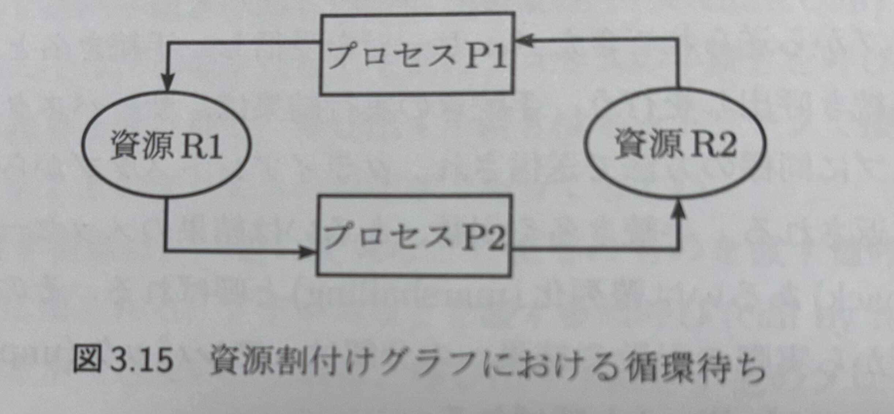
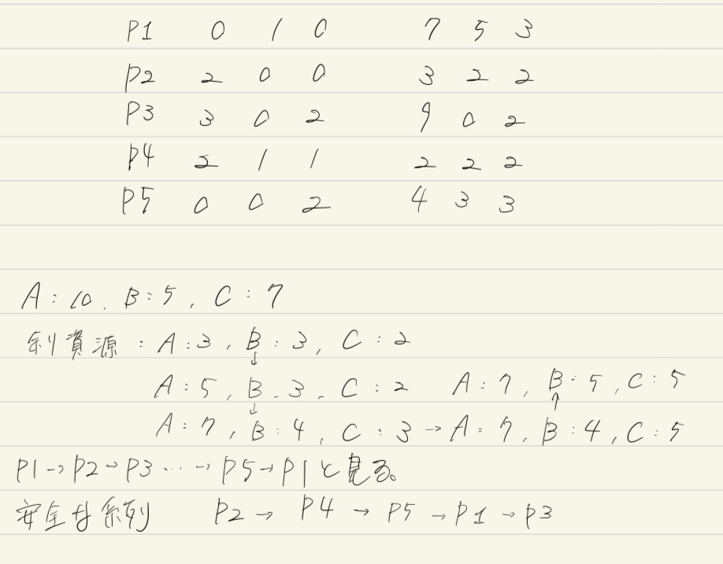
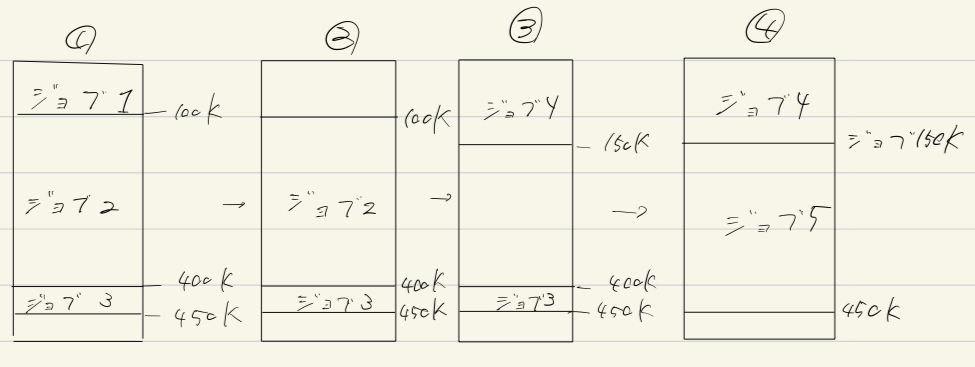
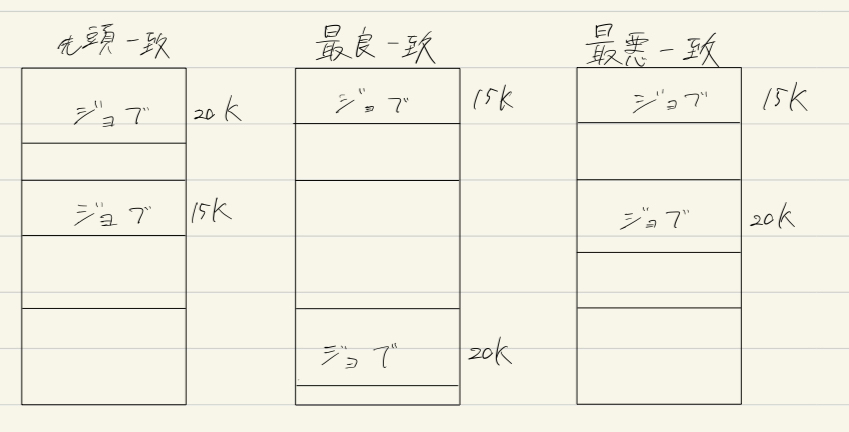

# 3章

> 1. プロセス間通信では、send 命令と receive 命令を使う。この引数は何か。
- send命令
  - destination
    - メッセージの宛先を示す
  - message_list
    - 送るメッセージの内容を保持している
- recieve命令
  - source
    - メッセージの送り主を示す
  - variable_list
    - 変数のリストを示す 
> 2. 通信チャネルとは何か。
- 受信側と送信側の指定をひとまとめにして読んだもの
- 別名:通信リンクという
> 3. 直接指名方式の問題点を述べよ。
- プロセス名が変更、および動的に変化した場合に相手のプロセス名を把握できなければ送受信不可能となること
- 1対1の通信にしか使用できない
> 4. 同期通信と非同期通信の違いを述べよ。
- 同期式はメッセージの受け渡しが完了するまで待機するが、
非同期式は送受信要求がバッファにキューイングされ送受信の呼び出しもとに直ちに制御が戻される方式のこと 
> 5. 共有メモリ・パイプ・メールボックス・ポート・RPC の仕組みを説明せよ。
- 共有メモリ
  - メモリの一部を共有することによって同期を実現する方法
- パイプ
  - readとwriteの2つの操作で行っている
    - read
      - パイプにメッセージがたまるまで待つ
    - write
      - パイプが満タンになるまでパイプに書き込むことができる
  - ある特定のプロセスが所有するのではなく、複数のプロセスによって使用されるメッセージ交換のためのチャネルである
- メールボックス
  - 任意のプロセスから任意のプロセスにsend命令を送信できる
  - 任意のプロセスがreceive命令によってメッセージを受け取ることができる
- ポート
  - あるポートを指定するすべてのreceiveが同一のプロセス内で生じる
  - 各々のプロセスが高々1つのメールボックスしか持たないようにしている
- RPC(遠隔手続き呼び出し)
  - 以下の操作を通常の手続き呼び出しと同じように実現する機構のこと
    - クライアント/サーバモデルにおいてクライアントがサーバに要求を出す。
    - サーバが応答を返すのを待つ。
> 6. クライアント/サーバモデルについて説明せよ。
- 要求を出すクライアントプロセスと要求を処理するサーバプロセスとの間の関係で通信をモデル化すること
- 通信チャネルの実現方式を考える場合に有効
- 多対多の通信が可能
> 7. デッドロックとは何か。資源割付グラフを用いて説明せよ。
- 以下のpngファイルのように、あるプロセスが要求した資源がほかの待ち状態にあるプロセスに割り付けられている場合に発生しうる状況のこと
- pngファイル

> 8. デッドロックの発生条件と防止方法を述べよ。
- 発生条件(以下の4つの必要条件からなる)
  - 相互排除条件
    - プロセスは、必要とする資源の相互排除を要求する
  - 待ち条件
    - プロセスは、さらに必要とする資源を待っている間、すでに自分に割り付けられた資源を保持している
  - 横取り不可能条件
    - 資源は使い終わるまでそれらを保持しているプロセスから取り上げられない
  - 循環待ち条件
    - 7で示したように、あるプロセスによって要求される資源を各プロセスが保持しているプロセスの循環待ちが存在する
- 防止方法
  - 以上のどれかを防げばデッドロックは発生しないのでそれぞれどれかを解決すればよい
  - 相互排除条件
    - 任意の資源について成立しないようにすることは不可能
  - 待ち条件
    - 各々のプロセスは、必要とするすべての資源を同時に要求するようにすればよい。
    - 全てが許可されるまでは先へは進めない
  - 横取り不可能条件
    - 資源を保持しているプロセスがさらに資源を要求することができなければ保持している資源を解放し、必要であれば再び全てを要求しなければならない
  - 循環待ち条件
    - 全てのプロセスに資源の方の線形順序をつける
      - つまり、あるプロセスに特定の方の資源が割り付けられた場合、以降そのプロセスは割り付けられた方の後の順序の資源しか要求できない。
> 9. デッドロック問題において安全なシステムとは何か。
- デッドロックを回避できるシステムのこと
> 10. 図 3.17 を簡約し、デッドロックが発生しているか調べよ。
- 以下のpngファイルより、発生していない
- pngファイル

> 11. デッドロックからの回復方法を説明せよ。
- 循環待ちを解除すれば回復できる。これには以下のいずれかの方法がある
  - 1. デッドロック状態にあるプロセスの1つを消滅(異常終了)させる
  - 2. デッドロック状態にあるプロセスの1つを元の状態に戻し、すなわち後退復帰し、しばらくしてそのプロセスは再び必要とする資源を要求する。
> 12. 章末問題 3.10
- 以下のpngファイルを参照する。
- pngファイル

# 演習

演習で用いたコマンドや関数について
実行結果から動作を読み取る

> cat
- ファイルの内容を標準出力に出力する
> paste
- 複数のファイルを行単位で連結する
> join
- 二つのテキストファイルの内容を比較し、共通する項目がある行を連結する
> grep
- ファイルの中の特定の文字列がある行を抽出するコマンド
> cut
- ファイルの各行から、バイト、文字、フィールドをカットして、これらを標準出力に書き出す
> tail
- 指定されたファイルの指定されたポイントから始まる部分を標準出力に書き出す
> head
- 指定した各ファイルまたは標準入力の指定した行の数またはバイトを標準出力に書き出す
> sort
- ファイルをソートしたり、すでにソートされているファイルをマージしたり、ファイルを検査してソートされているかどうか判別する
> uniq
- ファイル内の反復業を報告するか、削除する
> wc
- ファイル内の行数、ワード数、バイト数、または文字数を数えます。

# 4章

> 1. 階層記憶について説明せよ。
- 経済的な制約の範囲内でシステムの性能を低下させることなく、予想されるユーザの仕事を処理するのに十分な主記憶の容量を保証するために考え出された記憶管理方法
- キャッシュ記憶、主記憶、二次記憶からなる
- 上位の層に行くほど高速で高価な記憶装置が使用される
> 2. フェッチ技法・割付け技法・置換え技法とはそれぞれ何か。簡単に説明せよ。
- フェッチ技法
  - プログラムあるいはデータを主記憶上にいつ読み出すかに関するものである。
  - 主要なものとして以下の2つがある
  - 要求時フェッチ
    - 参照されたときにプログラムあるいはデータを主記憶に転送する方法
    - 実行中のプログラムが次にどの部分を参照するかを一般に予測できないため、この方法がよくつかわれている
  - プリフェッチ
    - 参照前にあらかじめ読みだしておく方法
- 割り付け技法
  - 読みだしたプログラムあるいはデータを主記憶上のどこの領域に置くかに関するものである
- 置換え技法
  - 新しいプログラムのための空き領域を作るために、すでに主記憶上に存在しているプログラムあるいはデータのどの部分を2次記憶に追い出すかに関するものである
> 3. 要求時フェッチとプリフェッチとの違いを述べよ。
- 2で述べたものより、参照されたときに主記憶に転送するか、その前にあらかじめ読みだすかの違い
> 4. 再配置可能プログラムとはどのようなプログラムか説明せよ。
- 他のオブジェクトプログラムとの結合時あるいは実行時に別のアドレスを起点とするようにアドレスを再計算することによって、主記憶上の任意の位置で実行することが可能であるプログラムのこと
> 5. 動的再配置と静的再配置の違いを述べよ。
- 動的再配置はOSとユーザ領域の境界アドレスが変更されると、プログラムを再ロードする必要がないが、静的再配置はプログラムを再ロードする必要がある。
> 6. スワッピングの仕組みを説明せよ。
- 主記憶上のプログラムが何らかの原因で待ち状態となったときに、そのプログラムを現在の状態を2次記憶に退避し、別のプログラムをロード、実行すること
> 7. オーバレイの仕組みを説明せよ。
- 主記憶上にプログラムの一部のみを置いて実行すること
> 8. 絶対アドレス指定による固定区画割付けについて説明せよ。
- 各ジョブが必要とする主記憶の容量よりも大きくて、その容量が一番近い区画を選択する
> 9. 相対アドレス指定による固定区画割付けについて説明せよ。
- この方法を行うにはジョブが再配置可能でなければならない
- 全てのジョブにキューを割り付ける方法
> 10. 内部断片化と外部断片化について説明せよ。
- 内部断片化
  - 区画が未使用であるにもかかわらず使用不可能となっている状況のこと
- 外部断片化
  - 各区間でジョブが実行されている場合に各区画内で未使用領域が存在する場合に各区画内で未使用領域が存在する状況のこと
> 11. コンパクションの目的について述べよ。
- 断片化しているすべてk¥の空き領域を1つの大きな空き領域にまとめるために、主記憶の区画を別の場所に移動すること
> 12. 空き領域の割付け技法を3つ挙げ、それぞれについて説明せよ。
- 先頭一致
  - 空き領域の中で最初に見つかった十分な大きさの領域を割り付ける。
  - 最速で行うことができる
- 最良一致
  - 大きさが十分である最も小さな空き領域を割り付ける。
  - 空き領域のリストが大きさの順になっていないとリスト全体を探索する必要がある
  - 最も小さな空き領域を生成する
- 最悪一致
  - 空き領域のなあで最大の空き領域を割り付ける
  - 空き領域のリストが大きさの順になっていないとリスト全体を探索する必要がある
  - 最も大きな空き領域を作り出す
> 13. 記憶保護の目的は何か。
- OSの領域をユーザープログラムによる不当なアクセスから保護するため
- ユーザープログラム間で互いの領域の不当なアクセスから保護するため
> 14. 記憶保護の仕組みを説明せよ。
 - アクセスされるアドレスが境界レジスタに記録されている範囲外であれば不当なアクセスとなり、アドレスエラーを発生させる
> 15. 章末問題 4.8, 4.9
- 4.8
  - 1. 以下のpngファイルの通り
  

  - 2. 2~3の部分
  - 3. 細かく分割された空き領域が単一の大きな空き領域となる
- 4.9
