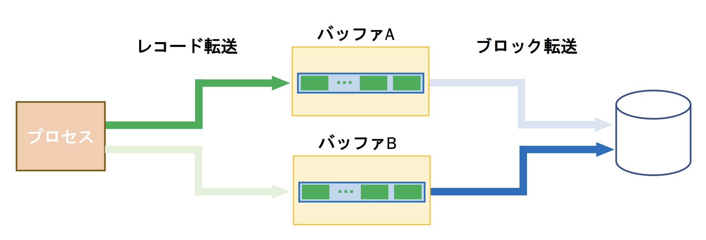
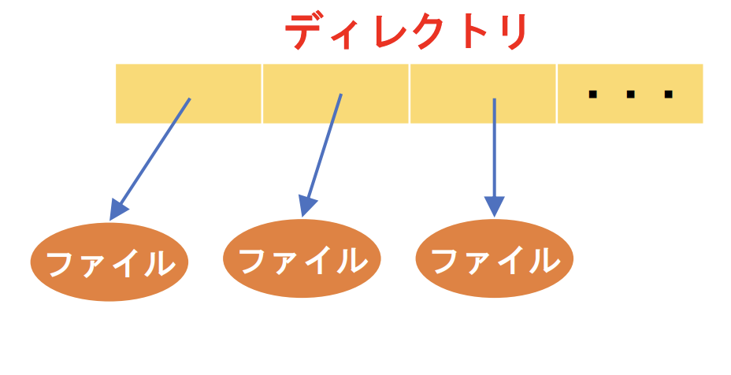
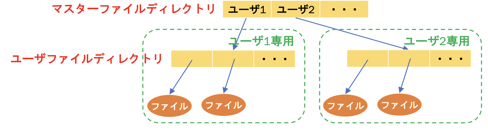
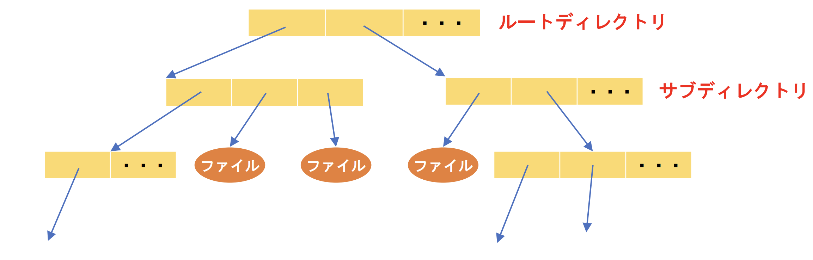

## オペレーティングシステム 第5章 まとめ

1. 仮想記憶を用いる目的について説明せよ。

- プロセスが使用するアドレスを実際に有効な主記憶のアドレスから独立させるため

2. 仮想記憶と実記憶の関係について説明せよ。

- 仮想記憶は、主記憶装置(実記憶)と補助記憶装置を組み合わせて大容量のメモリ空間を提供し、動的アドレス変換機構によって仮想アドレスを実アドレスに変換することで、プログラムに対して大きなメモリを利用可能にする。

3. 動的アドレス変換機構の役割は何か。

- プロセスが実記憶に読み込まれ処理するときに実アドレスに変換する役割。

4. ページングの仕組みについて説明せよ。

- 仮想記憶をページごとに分割し、実記憶をページと同じサイズのページ枠に分割している。

5. ページテーブルのエントリから、仮想アドレスに対応する実アドレスを計算せよ。

- 仮想アドレスの先頭4bitをページ枠番号に置き換える

6. ページとセグメントについて、共通点と違いについて述べよ。

- 共通点
  - セグメントテーブルとページテーブル
  - セグメントフォルトとページフォルト
- 相違点
  - セグメンテーション:可変サイズのブロック(セグメント)
    - 関数
    - データの塊
    - etc...
  - ページング:固定サイズのブロック

7. 要求時ページングとプリページングの利点・欠点を述べよ。

- 要求時ページング
  - 利点
    - 無駄なページをページインしない
    - 使用されるページの予測が不要
  - 欠点
    - ページフォルトサービスのオーバヘッドのため、処理速度が低下
- プリページング
  - 利点
    - 多くの場合で予測可能なら、実効アクセス速度が改善される
  - 欠点
    - 予測が外れるとページイン時間、主記憶の無駄遣いとなる。(主記憶が大量にあれば，主記憶の無駄遣いは無視できる)

8. 実効アクセス時間をE、主記憶アクセス時間をM、ページフォルトの確率をp、ページフォルトのためのサービス期間をFとする。p=0.00001、M=1$μ$秒のとき、ページフォルトによる性能低下を10%以下に抑えるには、Fは何秒以下である必要があるか。

$E,M,p,F$の関係式は$E = pF + (1-p)M$である
今回は`ページフォルトによる性能低下を10%以下に抑える`とあるので$E \leqq 1.1M$となるはずである。
従って$1.1 \times (1 \times 10^{-6})  \leqq 10^{-5} \times F + (1-10^{-5}) \times (1 \times 10^{-6})$となる
これを計算すると$F \leqq 0.010001$となる

9.  ページ枠数4、参照ストリング0,1,2,3,2,1,4,5,3,2,4,5が与えられるとき、FIFO、OPT、LRUの各置換え技法でのページフォルト数を求めよ。

- FIFO
  - 以下の表よりページフォルトは6

|ページ枠数\参照str|0|1|2|3|2|1|4|5|3|2|4|5|
|:--|:--|:--|:--|:--|:--|:--|:--|:--|:--|:--|:--|:--|
|1|0|1|2|3|3|3|4|5|5|5|5|5|
|2||0|1|2|2|2|3|4|4|4|4|4|
|3|||0|1|1|1|2|3|3|3|3|3|
|4||||0|0|0|1|2|2|2|2|2|
|pagefault|1|1|1|1|0|0|1|1|0|0|0|0|

- OPT
  - 以下の表よりページフォルトは6

|ページ枠数\参照str|0|1|2|3|2|1|4|5|3|2|4|5|
|:--|:--|:--|:--|:--|:--|:--|:--|:--|:--|:--|:--|:--|
|1|0|1|2|2|1|3|3|3|2|4|5|2|
|2||0|1|1|3|2|2|2|4|5|2|3|
|3|||0|3|2|1|4|4|5|2|3|4|
|4||||0|0|0|1|5|3|3|4|5|
|pagefault|1|1|1|1|0|0|1|1|0|0|0|0|

- LRU
  - 以下の表よりページフォルトは8

|ページ枠数\参照str|0|1|2|3|2|1|4|5|3|2|4|5|
|:--|:--|:--|:--|:--|:--|:--|:--|:--|:--|:--|:--|:--|
|1|0|1|2|3|2|1|4|5|3|2|4|5|
|2||0|1|2|3|2|1|4|5|3|2|4|
|3|||0|1|1|3|2|1|4|5|3|2|
|4||||0|0|0|3|2|1|4|5|3|
|pagefault|1|1|1|1|0|0|1|1|1|1|0|0|

10.  Beladyの異常について説明せよ。

- ページ枠数が増えてもページフォルト率が上昇する現象(本来、単調減少となるはずである)
- スタックアルゴリズムクラスに属するアルゴリズムではBeladyの異常は発生しない

11. 大域置換えと局所置換えの違いと特徴について述べよ。

- 違い

|/|大域置換え|局所置換え|
|:--|:--|:--|
|各プロセスのページ枠数が変化|する|しない|
|活発なプロセスほど多くのページ枠数を確保|できる|できない|
|システム全体のページフォルト率の改善効果|ある|ない|
|自プロセスのページフォルト率をコントロール|できない|できる|

- 特徴
  - 大域置換え
    - すべてのページが置き換え対象
  - 局所置換え
    - 自プロセスのページが置き換え対象

12.   割付アルゴリズムにおいて、均等割り付けと比例配分割り付けについて説明せよ。

- 均等割り付け
  - すべてのプロセスに同数のページ枠を割り付ける
  - 簡単なアルゴリズム
  - 外部断片化の恐れあり
- 比例配分割り付け
  - プロセスの特性に応じてページ枠数を割り付ける
  - 使用している仮想記憶サイズ、CPU使用率、優先度など
  - ページフォルト率を下げようとしている

13.  スラッシングとは何か。なぜ発生するのか。抑制するにはどうしたらよいか。

- スラッシング
  - ページフォルトが頻発してCPU使用率が低下していること
- 発生する理由
  - 以下の工程が悪循環し続けることで発生する(2〜4はCPU使用率が低下しなければ問題ない)
  1. 新しいプロセスが生成
  2. 新しいプロセスのためページフォルトが発生
  3. 新しいプロセスのために既存プロセスのページを置き換え
  4. 既存プロセスでもページフォルト発生
  5. CPU使用率が低下
  6. CPU使用率を上げるために新しいプロセスを生成
- 抑制方法
  - 多重度を上げてCPU使用率が低下する時は、それ以上多重度を上げないような仕組みが必要

14.  参照の局所性における時間的局所性と空間的局所性について述べよ。

- 時間的局所性
  - 最近参照されたページは，近い将来再び参照される確率が高い
- 空間的局所性
  - 参照されたページの近くのページは参照される確率が高い

15.  ワーキングセットとは何か。

- プロセスが時間的・空間的局所性に基づいて近い将来参照すると予測されるメモリページの集合である

16. ワーキングセット法のウィンドウサイズが適切でない場合どのような問題があるか。

- 小さすぎる場合
  - ワーキングセット全体が入りきらない(ページフォルト率が高くなる)

- 大きすぎる場合
  - ワーキングセット以外がページインする(主記憶の無駄遣いとなる)

## オペレーティングシステム 第6章 まとめ

1. レコードとブロックについて説明せよ。

- レコード
  - 情報の一つの単位として扱われる関連したデータの集まり。
- ブロック
  - 物理レコードともいう
    - 記憶装置が扱うレコード
    - 記憶装置との入出力の単位

2. ファイル制御ブロックについて説明せよ。

- ファイルに関する情報のひとかたまり
  - ファイル名，
  - 型
  - サイズ
  - 保護情報
  - 2次記憶の位置
  - 作成日時
  - etc...

3. ファイルのオープンとクローズの役割について述べよ。

- オープン
  - ファイルを操作することをOSに知らせる
- クローズ
  - ファイルを操作しないことをOSに知らせる
- 補足
  - オープンの知らせを受けたOSは
    - FCB領域を作成
    - FCBに必要な情報を2次記憶から読み出し
  - クローズの知らせを受けたOSは
    - FCBの情報を2次記憶に保存
    - FCB領域を解放

4. バッファリングの目的と仕組みについて説明せよ。

- 目的
  - 主記憶-2次記憶間の低速な転送を何度も行うことを避けるため
- 仕組み
  - バッファに主記憶から2次記憶に転送するレコードをブロックにまとめてから2次記憶に転送するブロッキングと呼ばれる操作を行う
5. ダブルバッファリングについて図を用いて説明せよ。

- 以下の図のようにバッファを2台用意し、以下の操作を行うこと
  - バッファリング同様に片方のバッファがいっぱいになるまでレコードを転送し続ける
  - いっぱいになったらそのバッファを2次記憶に転送する
  - 転送している際は転送していない側のバッファにレコードを転送する

6. 逐次アクセス・直接アクセス・動的アクセスについて説明せよ。

- 逐次アクセス
  - 先頭から順にアクセスする方法
  - 入出力で転送されるブロックの順が2次記憶の格納位置によって決定
- 直接アクセス
  - 目的のブロックに直接(先頭からでなくという意味)アクセスする方法
- 動的アクセス
  - 直接アクセスと逐次アクセスを組み合わせた方法
    - アクセスしたいブロックの先頭を直接アクセス
    - その後，ブロックを逐次アクセス

7. 順編成ファイル・直接編成ファイル・区分編成ファイル・索引順編成ファイルについて説明せよ。

- 順編成ファイル
  - 先頭から順にレコードをアクセスするファイル
  - 逐次アクセスに適している．
- 直接編成ファイル
  - レコード中のキーを用いて格納位置を求めるファイル
  - 直接アクセスに向いている．
  - 格納位置の計算方法をどうするか．
  - アプリケーション側(OSではなく)が格納位置を管理する必要がある
- 区分編成ファイル
  - 順編成のレコードを「メンバ」として「ディレクトリ」に登録
  - メンバの先頭へは直接アクセス，メンバー内では逐次アクセス
  - 動的アクセスに向いている
- 索引順編成ファイル
  - 索引を使った直接アクセス
  - キーを使った逐次アクセス
  - 索引の管理が必要
  - 検索の効率の問題
  - あふれ域が大きくなったら再編成

8. ディレクトリの操作を4つあげよ。

- 追加
- 削除
- 検索
- 一覧

9.  単一レベルディレクトリ・2階層ディレクトリ・木構造ディレクトリについて、それぞれ図を用いて説明せよ。

- 単一レベルディレクトリ
  - 以下の図のようにメインディレクトリにすべてのファイルの情報が格納されている

- 2階層ディレクトリ
  - 以下の図のようにマスターファイルディレクトリでユーザーを分別し、ユーザーごとのユーザーファイルディレクトリを割り当てる
  - 単一ディレクトリに比べて視認性が多少上昇し複数ユーザーが使用した際、アクセス権の問題が解消される

- 木構造ディレクトリについて
  - 以下の図のようにディレクトリの内部にさらにディレクトリを作成することができる
  - これによって視認性の上昇、ファイル名重複の危険性が改善される

10.  UNIXでのパス指定~~やアクセス制御~~をできるようにすること。

木構造ディレクトリの場合を考える

- 相対path
  - カレントディレクトリからのパス名
    - ./でカレントディレクトリを指す
    - ../で親ディレクトリを指す
    - /aとすると/の前のディレクトリ内のaというファイル(もしくはディレクトリ)を指す
- 絶対path
  - ルートディレクトリからのパス名
