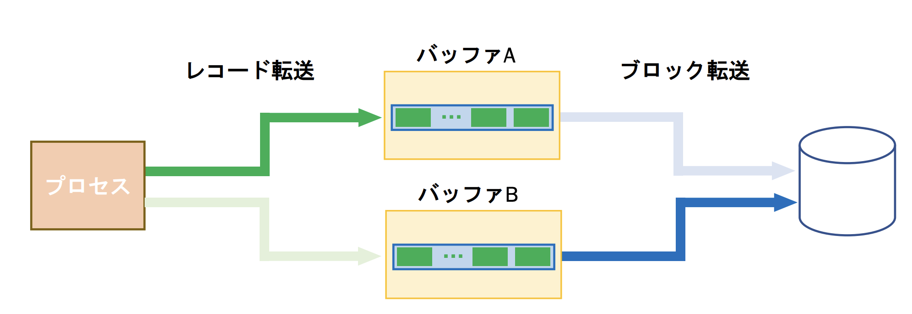
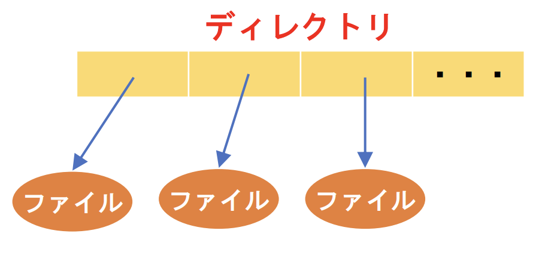
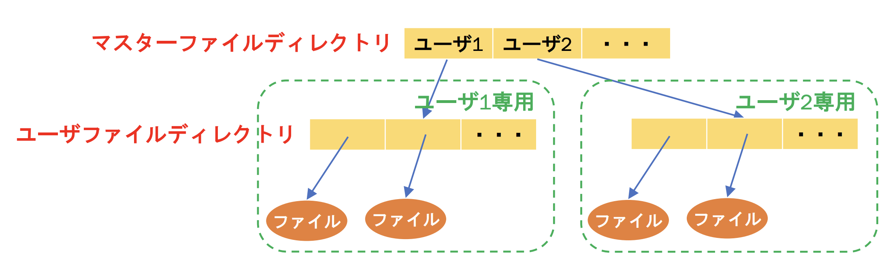
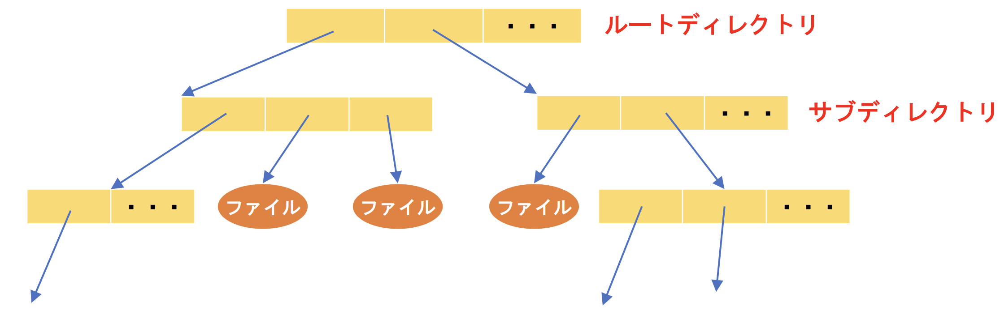

# オペレーティングシステム まとめ  

## 第6章

> 1. レコードとブロックについて説明せよ。  

レコードは互いに関連した項目からなっており、レコードの集合は記録の単位となる。この記録の単位はブロックと呼ばれる
> 2. ファイル制御ブロックについて説明せよ。  

ファイルを操作する場合、最初に作成されるファイルに対応したシステムテーブルのこと。これには以下のものが含まれる
- ファイルの名前
- ファイルの型(ソースプログラム、オブジェクトプログラムなど)
> 3. ファイルのオープンとクローズの役割について述べよ。  
#### オープン
ファイルを使用することをシステムに知らせるためのもの
#### クローズ
ファイルの使用を終了したことをシステムに知らせるためのもの
> 4. バッファリングの目的と仕組みについて説明せよ。  
#### 目的
CPU処理と入出力処理のオーバラップを可能にし、CPUの利用率を向上させるため
#### 仕組み
ファイルと作業領域間をレコード/ブロックごとに送信するのではなく、一度バッファにまとめて送信し、送信時間を短縮している
> 5. ダブルバッファリングについて図を用いて説明せよ。  

以下の図のようにバッファを2つ用意し、片方の空きがなくなるまでレコードを入れ続け、空きがなくなったらもう1つのバッファにレコードを入れる方法

> 6. 逐次アクセス・直接アクセス・動的アクセスについて説明せよ。  
#### 逐次アクセス
2次記憶城のブロックの並びに従ってアクセスされる
#### 直接アクセス
ランダムアクセスファイルとも呼ばれ、ユーザーが指定したブロック番号を直接読み出したり、書き込んだりすることが可能になる
#### 動的アクセス
ファイルにアクセスするために、キーによって索引を検索し、該当する索引のエントリを見つける。次に、そのキーに対応するに次期屋上のブロックの物理アドレスを使用して、当該ブロックを直接アクセスする
> 7. 順編成ファイル・直接編成ファイル・区分編成ファイル・索引順編成ファイルについて説明せよ。  
#### 順編成ファイル
先頭から順にレコードをアクセスするファイル
#### 直接編成ファイル
レコード中のキーを用いて格納位置を求めるファイル
#### 区分編成ファイル
順編成のレコードを「メンバ」として「ディレクトリ」に登録し、メンバの先頭には直接アクセス、メンバ内でのアクセスは逐次アクセスで行うファイル
#### 索引順編成ファイル
索引を使った直接アクセスとキーを使った逐次アクセスを行えるファイル
> 8. ディレクトリの操作を4つあげよ。  
1. 検索
2. ディレクトリエントリの追加
3. ディレクトリエントリの削除
4. ファイル一覧の表示
> 9. 単一レベルディレクトリ・2階層ディレクトリ・木構造ディレクトリについて、それぞれ図を用いて説明せよ。  
#### 単一レベルディレクトリ
最も単純なディレクトリの階層であり、全てのファイルに関する情報が1つのディレクトリに格納される

#### 2階層ディレクトリ
ユーザごとの独立ディレクトリとして、ユーザファイルディレクトリが作成される。これは当該ユーザが保有しているファイルに関する情報のみが格納される。また、ユーザファイルディレクトリを識別するためにその上にマスタファイルディレクトリが構成される。これの各エントリは、ユーザ名によって識別され、ユーザファイルディレクトリへのポインタが格納される。

#### 木構造ディレクトリ
1つのルートディレクトリを持ち、システム内のすべてのファイルは一意のパス名を持つ。パス名はすべてのサブディレクトリを経由するルートから特定のファイルまでの経路である。従ってファイルをアクセスする場合はファイルのパス名を指定すれば良い。

> 10. アクセス制御の目的は何か述べよ。  
各ファイルに関してユーザによるファイル操作の種類を制限することによって、ファイルの共有を管理する。アクセス制御の対象となる基本的なファイル操作には以下のものがある。
1. 読み出し
2. 書き込み
3. 実行
4. 追加
5. 削除
> 11. ユーザクラスを用いるメリットを述べよ。  

多くのユーザ、およびファイルが登録されている場合を考慮する。その時、アクセス制御行列、あるいはアクセスリストを使用した方法と比較して使用するフィールドの大きさを格段に小さくすることができる。
> 12. バックアップと回復について説明せよ。  
#### バックアップ
ファイルを周期的に何らかの記憶媒体にコピーしておく方法のこと。
#### 回復
ファイルが破壊された時にディスクに再ロードすること。
> 13. RAIDについて説明せよ。  

複数台のHDDに同時にファイルを保存することで，耐障害性を向上させる方法のこと
> 14. 二次記憶の割付技法の連続割付け・リンク割付け・索引割付けについてそれぞれ説明せよ。  
#### 連続割り付け
データを物理的に連続して格納する方法。ユーザはファイル作成時にファイルサイズを指定する必要がある。
#### リンク割り付け
2次記憶上のブロックのリストとして構成され、ディレクトリの各エントリがファイルの先頭ブロックと最終ブロックの番号を保持している。
#### 索引割り付け
すべてのポインタを1つのブロック、すなわち索引ブロックに格納することによって、直接アクセスを可能にしている
> 15. UNIXでのパス指定やアクセス制御をできるようにすること。  

## 第7章

> 1. 入出力待ちで割り込みを用いる利点を挙げよ。  

CPUのデータ転送速度に比べ、入出力機器（特に機械的なもの）転送速度は極端に遅いため、入出力が完了するまでCPUがアイドル状態になる。これを原因とするCPUが長時間アイドル状態となることを防ぐことができる点。
> 2. 割り込みの種類を説明せよ。  
#### 内部割り込み/ソフトウェア割り込み
- マシンチェック割り込み
- 入出力割り込み
- タイマー割り込み
#### 外部割り込み/ハードウェア割り込み
- システムコール割り込み
- プログラム割り込み
> 3. 割り込みの処理方式について3つ挙げ、それぞれについて説明せよ。
#### 分岐方式
どの割り込みでも同じアドレスにジャンプし、要因ごとに分岐させる方法のこと
#### 割り込みベクタ方式
要因ごとにジャンプ先を変えることで割り込みの処理を変化させる方法のこと
#### 両方式の組み合わせ
一般的に以下のようになっている
##### 外部割り込み
割り込みベクタ方式を用いる。また、ハードウェアのサポートがある
##### 内部割り込み
割り込みの種類が多く、追加が容易であるため分岐方式を用いる。
> 4. 割り込み原因の解析について説明せよ。  

割り込みが発生した際にはその要因を解析し、対応する処理ルーチンへと移行する必要がある。この処理を行うのが割り込みハンドラである。
> 5. 割り込みフラグ・割り込みマスクの使い方について説明せよ。  
#### 割り込みフラグ
1bitで表され、全割り込みの許可/禁止を示す(1:許可、0:禁止)
#### 割り込みマスク
割り込みの種類分のbit数で表され、個々の割り込み要因の有効/無効を示す(1:無効、0:有効)
> 6. 入出力装置について説明せよ。  
入出力装置にはブロック型デバイスと文字型デバイスがある
#### ブロック型デバイス
ブロック単位で入出力できるデバイスであり、任意の位置のブロックにアクセスできる。
#### 文字型デバイス
文字単位(バイト単位)で入出力するデバイス(キーボードなど)であり、逐次的なアクセスしか行えない
> 7. デバイスドライバについて説明せよ。  

システムに接続されている入出力装置を制御するためのプログラムのこと。
> 8. デバイスコントローラについて説明せよ。  

CPUとのやりとりをするためのレジスタを備えており、CPUから受け取った命令(コマンド)を理解して入出力装置の制御、データの転送を行う
> 9. ディスクの構成について説明せよ。  

大きく分けて以下の4つがある
#### トラック
- プラッタを同一同心円上に区切った領域
- 同一同心炎上にあるセクタの集合
#### セクタ
- トラックを放射線状に区切った良識(外周ほどセクタ数を多くする構成もある)
- ディスクアクセスの最小単位
- 通常512byte、もしくは4096byte
#### シリンダ
- 複数のプラッタ上の同一位置にあるトラックの集合
- 同一シリンダのトラックにはヘッドの移動なしにアクセスできる
#### ヘッド
- プラッタの磁気情報を読み書きする部分
- 通常プラッタの両面に1つづつ
> 10. ディスクの記憶容量・アクセス時間の計算ができるようにすること。  

ヘッド数は(track/cylinder)と表されることに注意する。
> 11. PIO方式・DMA方式・チャネル方式について説明せよ。  
#### PIO方式
CPUがデータ転送を管理する方式のこと
#### DMA方式
DMAコントローラ(DMAC)がデータ転送を管理し、CPUは指示を与えるだけでよいため、より効率的に転送を行える
#### チャネル方式
> 12. ポートマップとメモリマップについて説明せよ。  
#### ポートマップ
実アドレスとは別にI/Oようのアドレスを用いるため、実アドレスを消費せずとも済む
#### メモリマップ
実アドレスの一部を割り当てるが今では実アドレス空間が十分大きいため、気にしなくてもよい。そのため現在ではこちらが主流となっている。
> 13. スプーリングの仕組みとメリットを説明せよ。  
#### 仕組み
入力に関して可能な限り先行して読み出しを行い、出力に関してはそれが可能となるまで出力結果をディスクに格納しておく
#### メリット
入出力を要求しているプロセス自体の待ち時間が短くなり、入力装置やCPUの利用率が向上すること
> 14. タイマ管理の機能を4つ挙げよ。  
1. ユーザ時刻の登録と更新
2. プロセスの一定時間の停止および経過の通知
3. プロセスへの信号の周期的な送信
4. 入出力装置の監視
